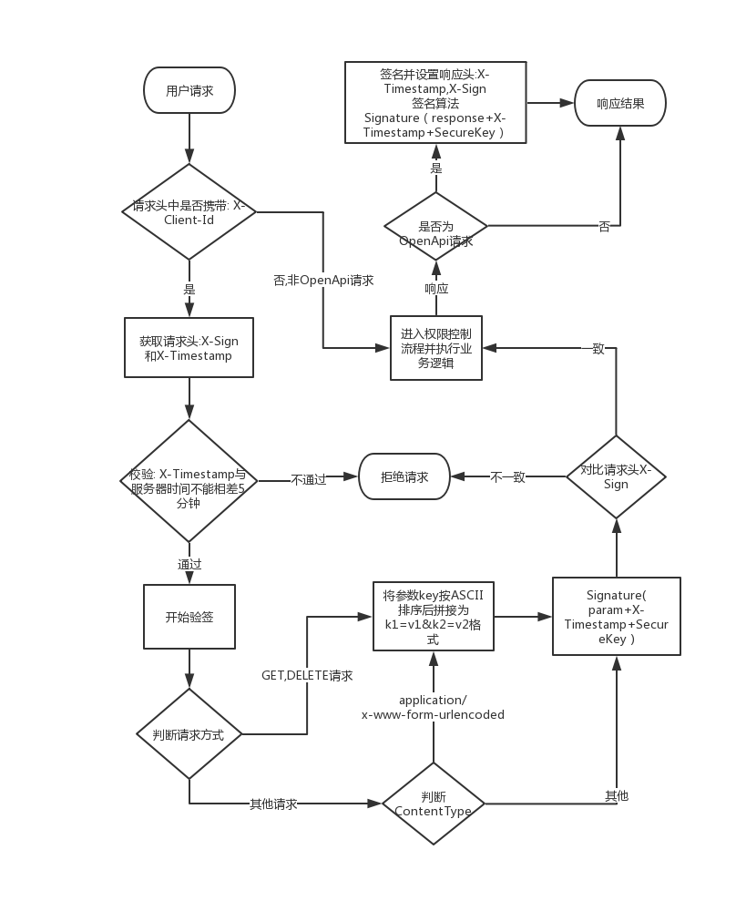

# OpenApi

基于数据签名的OpenApi模块

验证流程: 

[](images/OpenApi认证流程.png)

签名算法说明:

图中Signature函数为客户端设置的签名方式,支持MD5和Sha256.

例: 

ClientId为`testId`,
SecureKey为:`testSecure`.
客户端请求接口: `/api/device`,参数为`pageSize=20&pageIndex=0`,签名方式为md5.

1. 将参数key按ascii排序得到: pageIndex=0&pageSize=20
2. 使用拼接时间戳以及密钥得到: pageIndex=0&pageSize=201574993804802testSecure
3. 使用`md5("pageIndex=0&pageSize=201574993804802testSecure")`得到`837fe7fa29e7a5e4852d447578269523`
 
最终发起http请求为: 
```text
GET /api/device?pageIndex=0&pageSize=20
X-Client-Id: testId
X-Timestamp: 1574993804802
X-Sign: 837fe7fa29e7a5e4852d447578269523
```

响应结果:
```text
HTTP/1.1 200 OK
X-Timestamp: 1574994269075
X-Sign: c23faa3c46784ada64423a8bba433f25

{"status":200,result:[]}

```
验签: 使用和签名相同的算法(不需要对响应结果排序): 

```java

String secureKey = ...; //密钥
String responseBody = ...;//服务端响应结果
String timestampHeader = ...;//响应头: X-Timestamp
String signHeader = ...; //响应头: X-Sign

String sign = DigestUtils.md5Hex(responseBody+timestampHeader+secureKey);
if(sign.equalsIgnoreCase(signHeader)){
    //验签通过
    
}

```
